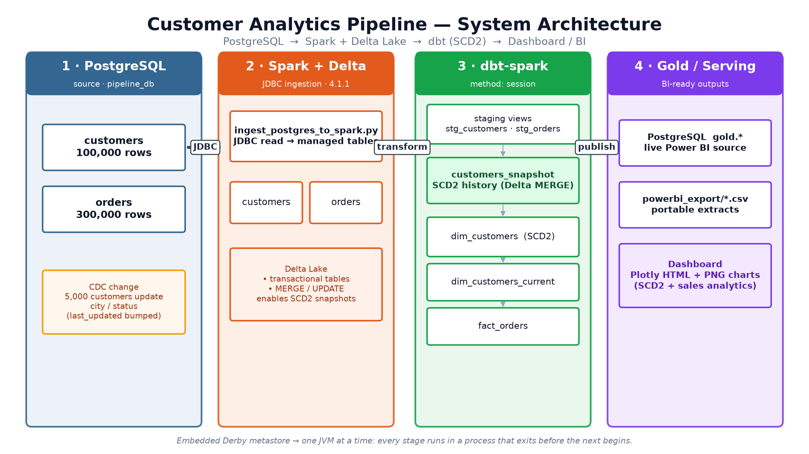
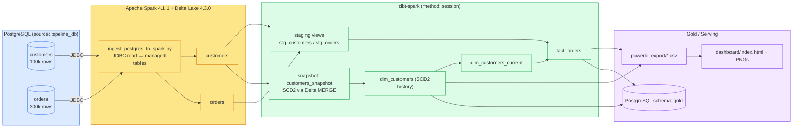
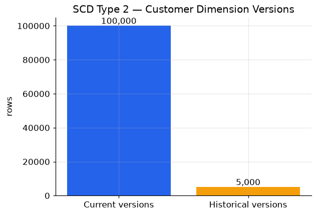
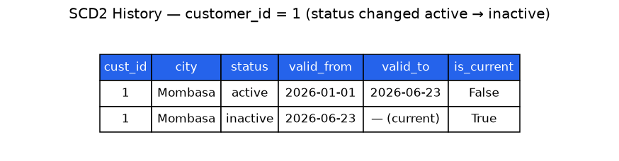
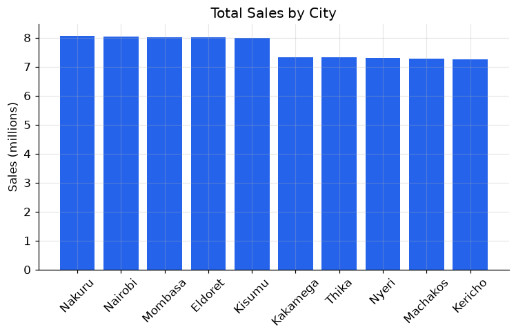
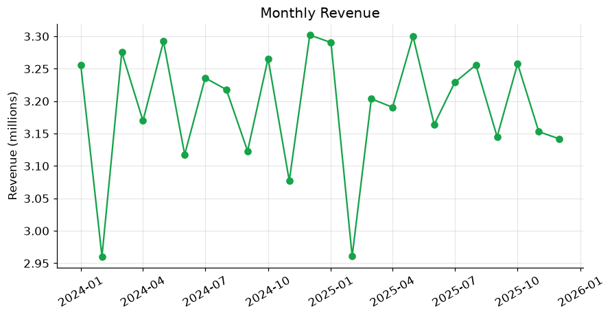
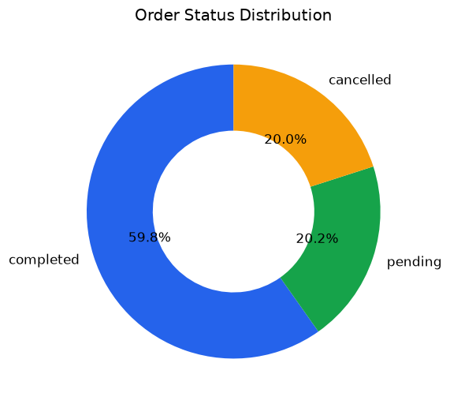
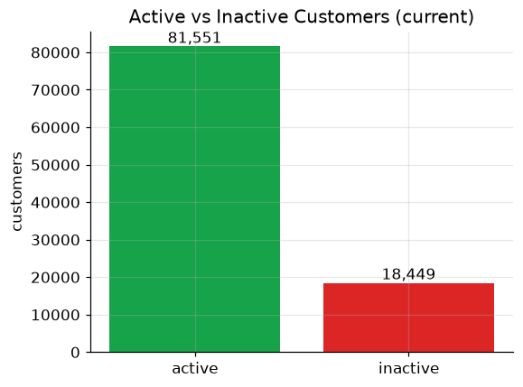
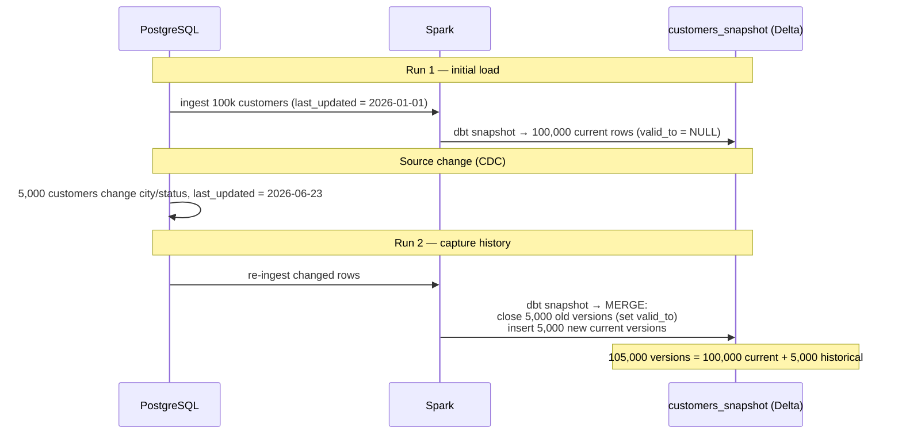
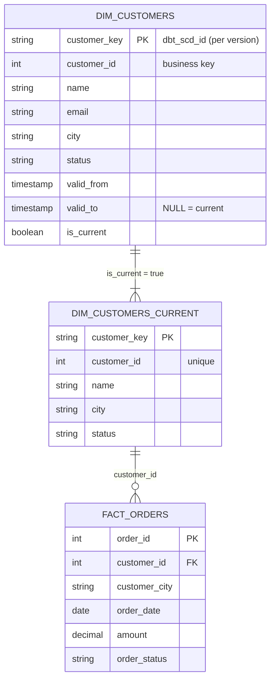

# Customer Analytics Pipeline — PostgreSQL → Spark → dbt (SCD2) → Dashboard

An end-to-end data-engineering project that ingests source data from
**PostgreSQL** into **Apache Spark** via JDBC, models a **Slowly Changing
Dimension Type 2 (SCD2)** customer dimension using **dbt snapshots** on **Delta
Lake**, builds a star schema, and publishes the results to an analytics
**dashboard** (and Power-BI-ready outputs).


---

## 1. System Architecture



The whole flow runs as a single orchestrated script (`run_pipeline.sh`). Because
local Spark uses an embedded **Derby** metastore that only **one JVM** may open
at a time, every stage runs in a process that exits before the next begins.

<details>
<summary>Mermaid source (editable diagram)</summary>



</details>

---

## 2. The Dashboard

> Power BI Desktop is Windows-only, so this repo ships a portable dashboard
> (`dashboard/index.html`, interactive Plotly) plus the static charts below.
> The same data is also published as CSV and to a PostgreSQL `gold` schema for a
> live Power BI connection — see [Section 6](#6-connecting-power-bi).

### SCD Type 2 — the headline

| Dimension versions | Example change history |
|---|---|
|  |  |

100,000 current customer versions + 5,000 historical (closed) versions =
**105,000 rows** of full audit history. The right-hand table shows one customer
whose `status` changed from `active` to `inactive`: the old version was closed
(`valid_to` stamped) and a new current version opened.

### Business analytics (from `fact_orders` + `dim_customers`)

| | |
|---|---|
|  |  |
|  |  |

---

## 3. How SCD2 is implemented

SCD Type 2 keeps **full history**: when a tracked attribute changes, the current
row is *closed* (an end-timestamp is written) and a *new* current row is
inserted — the old value is never overwritten.

This is modeled with a **dbt snapshot** (`snapshots/customers_snapshot.sql`)
using the **timestamp strategy** on the source `last_updated` column with
`unique_key = customer_id`. dbt maintains the bookkeeping columns:

| column           | meaning                                            |
|------------------|----------------------------------------------------|
| `dbt_valid_from` | when this version became effective                 |
| `dbt_valid_to`   | when it was superseded (`NULL` = current)          |
| `dbt_scd_id`     | surrogate key, unique per version                  |



### Why Delta Lake?
A dbt snapshot must **UPDATE** rows to close old versions, which plain
Hive/Parquet on Spark cannot do. Snapshots therefore require a transactional
table format — here **Delta Lake** (supports `MERGE`/`UPDATE`). It is configured
once in `spark_conf/spark-defaults.conf` and picked up by both the ingestion
script and dbt's in-process session via `SPARK_CONF_DIR`.

> `delta-spark 4.3.0` supports `pyspark <= 4.1.1`, so PySpark was pinned from
> 4.1.2 down to **4.1.1**.

---

## 4. Data model (star schema)



| object                          | type        | grain / purpose                                   |
|---------------------------------|-------------|---------------------------------------------------|
| `stg_customers`, `stg_orders`   | view        | light staging over the raw ingested tables        |
| `customers_snapshot`            | snapshot    | **SCD2 history** (Delta)                           |
| `dim_customers`                 | table       | SCD2 dimension — one row per customer **version**  |
| `dim_customers_current`         | view        | current version only — one row per `customer_id`   |
| `fact_orders`                   | table       | order grain, conformed to the current customer     |

---

## 5. Data quality tests

dbt tests guard the keys that make the SCD2 model and star schema correct
(`snapshots/_snapshots.yml`, `models/marts/_marts.yml`). Run with `dbt test`
— **16 tests, all passing**:

| object                  | column         | tests                                  |
|-------------------------|----------------|----------------------------------------|
| `customers_snapshot`    | `dbt_scd_id`   | `unique`, `not_null` (one row per version) |
| `customers_snapshot`    | `customer_id`  | `not_null`                             |
| `customers_snapshot`    | `dbt_valid_from`, `dbt_updated_at` | `not_null`         |
| `dim_customers`         | `customer_key` | `unique`, `not_null`                   |
| `dim_customers_current` | `customer_id`  | `unique`, `not_null` (current grain)   |
| `fact_orders`           | `order_id`     | `unique`, `not_null`                   |
| `fact_orders`           | `customer_id`  | `not_null`, `relationships` → `dim_customers_current` |

The `unique` test on `dbt_scd_id` proves the snapshot produces exactly one row
per customer version; `unique` on `dim_customers_current.customer_id` proves the
current view collapses SCD2 history to one live row per customer.

## 6. How to run

**Prerequisites:** PostgreSQL running with database `pipeline_db`, user
`pipeline_user` (see note on credentials below), and a Python virtualenv at
`../venv` with `dbt-core`, `dbt-spark`, `pyspark==4.1.1`, `delta-spark==4.3.0`,
`pandas`, `matplotlib`, `plotly`.

```bash
cd my_dbt_project
./run_pipeline.sh             # generate data + SCD2 demo + build models + publish
python build_dashboard.py     # build dashboard from the published gold CSVs
```

Re-run models only (keep current source data): `./run_pipeline.sh --no-gen`.

Run a single stage (always export the Spark conf dir first):

```bash
export SPARK_CONF_DIR="$(pwd)/spark_conf"
python ingest_postgres_to_spark.py   # PostgreSQL -> Spark
dbt snapshot                         # build/update SCD2 history
dbt run                              # build marts
python export_for_powerbi.py         # publish CSV + Postgres gold
```

### The Derby metastore gotcha
Local Spark (`method: session`) uses an embedded **Derby** Hive metastore at
`./metastore_db` that **only one JVM can open at a time**. If you see
`Unable to instantiate SessionHiveMetaStoreClient` / Derby `XSDB6: Another
instance ... already booted the database`, a Spark/PySpark process is still
holding the lock — **never leave a `pyspark` shell open while running dbt**.

---

## 7. Connecting Power BI

The pipeline produces two Power-BI-ready sources:

- **CSV (portable):** `powerbi_export/*.csv` → Power BI → *Get Data → Text/CSV*.
- **Live PostgreSQL (serving layer):** schema `gold` in `pipeline_db`
  (`gold.gold_dim_customers`, `gold.gold_dim_customers_current`,
  `gold.gold_fact_orders`) → Power BI → *Get Data → PostgreSQL database*.

**Suggested model:** relate `gold_fact_orders[customer_id]` →
`gold_dim_customers_current[customer_id]` (many-to-one); use `gold_dim_customers`
for as-was / historical analysis via `valid_from` / `valid_to` / `is_current`.

---

## 8. Repository layout

```
my_dbt_project/
├── run_pipeline.sh                 # one-command end-to-end orchestrator
├── ingest_postgres_to_spark.py     # JDBC ingestion: PostgreSQL -> Spark tables
├── export_for_powerbi.py           # publish gold tables -> CSV + Postgres 'gold'
├── build_dashboard.py              # build dashboard (PNGs + interactive HTML)
├── spark_conf/spark-defaults.conf  # Delta + JDBC config (via SPARK_CONF_DIR)
├── sql/
│   ├── 01_generate_source_data.sql # 100k customers + 300k orders
│   └── 02_simulate_changes.sql     # 5k changes to demonstrate SCD2
├── snapshots/customers_snapshot.sql# SCD2 snapshot (Delta, timestamp strategy)
├── models/
│   ├── staging/{_sources.yml, stg_customers.sql, stg_orders.sql}
│   └── marts/{dim_customers.sql, dim_customers_current.sql, fact_orders.sql}
├── dashboard/{index.html, img/*.png}
└── powerbi_export/                 # generated CSVs (git-ignored)
```

## 9. Tech stack

PostgreSQL · PySpark **4.1.1** · Delta Lake **4.3.0** · PostgreSQL JDBC **42.7.3**
· dbt-core **1.11** · dbt-spark **1.10** (`type: spark, method: session`)
· pandas / matplotlib / plotly (dashboard)

> **Credentials note:** the scripts default to a local throwaway dev credential
> (`pipeline_user` / `kali`) for a PostgreSQL instance that only runs on the
> developer's machine. Override any of `DB_HOST`, `DB_PORT`, `DB_NAME`,
> `DB_USER`, `DB_PASSWORD` via environment variables for any other environment.
